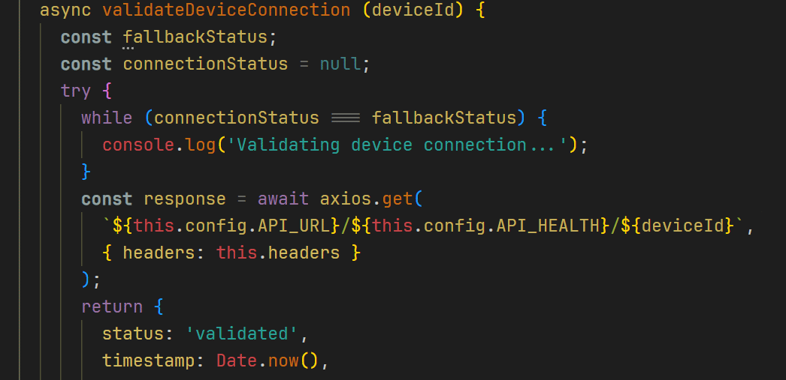

# selection-foreground - Selection Foreground Alternative

This extension allows to change color of selected text and kinda implements functionality of native `editor.selectionForeground` property (which doesn't work currently).

So now you can use contrast selection background color and see things clearly.

## Notes

It renders with a bit of delay, it's because of the way VSCode decorators work.

## Features

- Automatically highlights selected text with a specified color
- Supports multiple selections

## Configuration

- `selection-foreground.textColor` - color of selected text (default: `#000000`)
- `selection-foreground.enabled` - enable/disable extension (default: `true`)

## Usage

1. Set color via settings or with `selection-foreground.textColor` property
2. Command Palette: `Selection Foreground: Toggle`
3. Set some `editor.selectionBackground` if not set already
4. Select something
